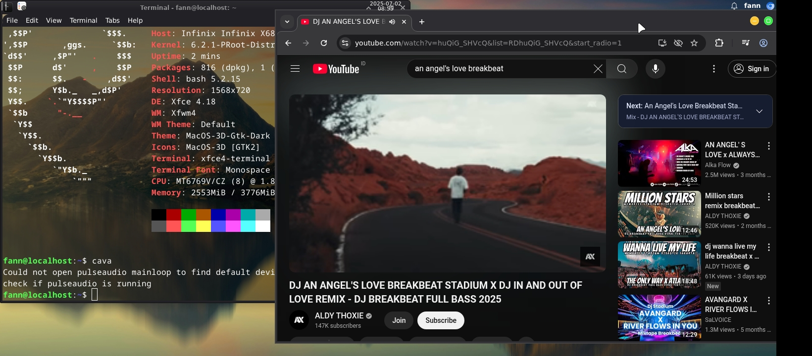

# Debian-XFCE-Mac-OS-Themes DEMO

> Run full Debian XFCE Desktop + GUI apps on Android using Termux + Proot-Distro + Termux-X11.

## ✨ Features
- XFCE4 Desktop with X11 support
- Lightweight and responsive
- Easy to install
- Compatible with Termux-X11


## 🖥️ Preview




## 🙌 Credits
Inspired by the Termux community, Linux DroidMaster.


## 📥 Download Debian Rootfs

[Click here to download Debian.tar.xz](https://example.com/debian.tar.xz)


## 🛠️ Installation with a rootfs file

> First step
This serves to allow Termux to access Android internal storage.
```bash
termux-setup-storage
```


> you need to install the following packages in Termux.

```bash
pkg update
pkg install x11-repo
pkg install termux-x11-nightly
pkg install pulseaudio
pkg install proot-distro
```
## ⚠️⚠️⚠️

> If you want to use the Debian Rootfs file, follow this command

> You can enter the directory where you store the debian rootfs file first

```bash
cd /storage/shared/download/
```

> to ascertain whether the debian rootfs file already exists

```bash
ls
```

> In your directory saving the debian rootfs file

```bash
proot-distro restore debian.tar.xz
```

> Wait until it's finished

> then return to home

```bash
cd
```
## Install the script to start a desktop

```bash
pkg install wget
wget ........demo
```

> give a file permission to execute

```bash
chmod +x debian.sh
```
> Then to start the desktop

```bash
./debian.sh
```

